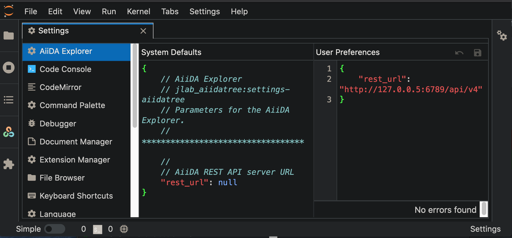

# jlab_aiidatree [IN-DEVELOPMENT]

[![GH Actions][ghaction-badge]][ghaction-link]
[![PyPI][pypi-badge]][pypi-link]
[![Binder][binder-badge]][binder-link]

A JupyterLab extension for exploring [AiiDA](https://www.aiida.net/) databases.
This is extension is intended to provide similar functionality for exploring graphs as the VS Code [AiiDA Explorer extension](https://marketplace.visualstudio.com/items?itemName=chrisjsewell.aiida-explore-vscode):

- View Processes
- Filter by process state
- Expand processes with their incoming/outgoing nodes
- View node attributes stored on the database
- Visualise node graphs (with D3 Graph)
- Visualise `StructureData` (the ThreeJS)


This extension is composed of a Python package named `jlab_aiidatree`
for the server extension and a NPM package named `jlab_aiidatree`
for the frontend extension.

## Install

To install the extension, execute:

```bash
pip install jlab_aiidatree
```

or also with aiida-core:

```bash
pip install jlab_aiidatree[aiida]
reentry scan
```

## Usage

### Connecting to AiiDA

You can connect to an AiiDA instance in one of two ways:

1. Directly using `aiida-core`, installed in the same environment as `jupyterlab` (the default).
2. Through an AiiDA instance serving the AiiDA REST API.

To start an AiiDA REST server, firstly `aiida-core` must be installed with the `rest` extra dependencies:

```bash
pip install aiida-core[rest]~=1.6
reentry scan
```

It is best to install this into a separate environment than you have your jupyterlab installation, to avoid dependency clashes.

Then you can start the REST server:

```console
$ verdi restapi -H 127.0.0.5 -P 6789
* REST API running on http://127.0.0.5:6789/api/v4
```

To connect to this server, simply change the `rest_url` setting to this URL:



:::{seealso}
https://aiida.readthedocs.io/projects/aiida-core/en/latest/howto/share_data.html?highlight=REST#launching-the-rest-api
:::

:::{important}
The URL is connected to from the server side of JupyterLab, i.e. where you are hosting it and not necessarily on your local machine.
:::

## Uninstall

To remove the extension, execute:

```bash
pip uninstall jlab_aiidatree
```

## Requirements

* JupyterLab >= 3.0

## Troubleshoot

If you are seeing the frontend extension, but it is not working, check
that the server extension is enabled:

```bash
jupyter server extension list
```

If the server extension is installed and enabled, but you are not seeing
the frontend extension, check the frontend extension is installed:

```bash
jupyter labextension list
```

## Coming Features

- View Computers and attached codes
- View Groups and attached nodes

## Contributing

### Development install

Note: You will need NodeJS to build the extension package, e.g.

```bash
conda create -n jupyterlab-ext --override-channels --strict-channel-priority -c conda-forge -c anaconda jupyterlab=3 nodejs jupyter-packaging aiida-core~=1.6
conda activate jupyterlab-ext
reentry scan
```

The `jlpm` command is JupyterLab's pinned version of
[yarn](https://yarnpkg.com/) that is installed with JupyterLab. You may use
`yarn` or `npm` in lieu of `jlpm` below.

```bash
# Clone the repo to your local environment
# Change directory to the jlab_aiidatree directory
# Install package in development mode
pip install -e .
# Link your development version of the extension with JupyterLab
jupyter labextension develop . --overwrite
# Server extension must be manually installed in develop mode
jupyter server extension enable jlab_aiidatree
# Rebuild extension Typescript source after making changes
jlpm run build
```

You can watch the source directory and run JupyterLab at the same time in different terminals to watch for changes in the extension's source and automatically rebuild the extension.

```bash
# Watch the source directory in one terminal, automatically rebuilding when needed
jlpm run watch
# Run JupyterLab in another terminal
jupyter lab
```

With the watch command running, every saved change will immediately be built locally and available in your running JupyterLab. Refresh JupyterLab to load the change in your browser (you may need to wait several seconds for the extension to be rebuilt).

By default, the `jlpm run build` command generates the source maps for this extension to make it easier to debug using the browser dev tools. To also generate source maps for the JupyterLab core extensions, you can run the following command:

```bash
jupyter lab build --minimize=False
```

### Development uninstall

```bash
# Server extension must be manually disabled in develop mode
jupyter server extension disable jlab_aiidatree
pip uninstall jlab_aiidatree
```

In development mode, you will also need to remove the symlink created by `jupyter labextension develop`
command. To find its location, you can run `jupyter labextension list` to figure out where the `labextensions`
folder is located. Then you can remove the symlink named `jlab_aiidatree` within that folder.


### Deploying

See <https://jupyterlab.readthedocs.io/en/stable/extension/extension_tutorial.html#packaging-your-extension>:

1. Update the `package.json` version key
2. Rebuild the package: `jlpm run build`
3. Ensure all linting and tests pass
4. Build the distribution

   ```bash
   pip install build
   rm -rf dist
   python -m build -s
   python -m build
   ```

5. Upload to PyPI using `twine`

   ```bash
   pip install twine
   twine upload --skip-existing dist/*
   ```

[pypi-badge]: https://img.shields.io/pypi/v/jlab_aiidatree.svg
[pypi-link]: https://pypi.org/project/jlab_aiidatree
[ghaction-badge]: https://github.com/chrisjsewell/jlab_aiidatree/workflows/Build/badge.svg
[ghaction-link]: https://github.com/executablebooks/jlab_aiidatree
[binder-badge]: https://mybinder.org/badge_logo.svg
[binder-link]: https://mybinder.org/v2/gh/chrisjsewell/jlab_aiidatree/master?urlpath=lab
